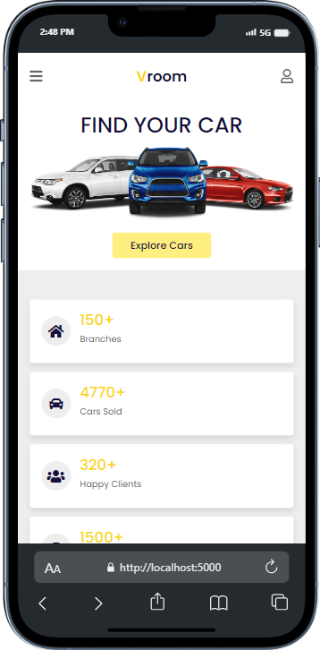

<div align="center">

<br>

<br>


# Car-Dealership-System-using-NodeJS-Express-MongoDB

</div>
<br/>

## 📌What is VROOM?

<h4 align="justify"> VROOM is a web-based application developed to provide digital retail services to automotive dealerships in order to facilitate zero-contact sales and services. It manages and track the entire vehicle sales, service, parts inventory seamlessly connecting the dealership increasing its efficiency. The customers can browse and then view the complete specification of each vehicle listing with its features and buy the vehicle as per their requirements creating an awesome retail experience to the customer. This is a simple yet efficient management system to manage records of dealership data instead of using traditional methods to manage data like manual records or file systems. Their customers can always be in the comfort of their homes to check the various vehicles, spare parts listed in the website for sale as to their choice. Hence reducing the cost, saving time and increasing the comfort of their customers.
</h4>
<br>


## 🧰 Tech Stack

      
<br>

#### 📊 Get Presentation Here  
[](https://docs.google.com/presentation/d/1532og5t_YkW8XZxuesFLbDnwodWDJxTA)
<br>
<br>


<br>
<br>

## 📋 Instructions
#### Application Structure
```
│
├── bin
├── models (MongoDB Mongoose Models)
├── node_modules 
├── public (application resources - css, js, images)
├── routes (handles admin, electric and gas routes)
├── views  (express-handlebars templates)
    ├── admin (admin templates)
    ├── layouts (default layout templates)
    └── electric and gas template files
├── app.js (root Node app script)
├── package.json
└── README.md
```


#### General
1. Install Dependencies using `npm install`
2. Make sure `MongoDB` server is running
3. Create a database named `autorizz`
4. Create all the required `collections` in the created database and fill in the data from `db_data`


#### Local
1. Inside  `--> app.js` under MongoDB section, replace the url with `mongodb://localhost:27017/autorizz`
2. Open Terminal in the app folder
3. Run `npm start` or `nodemon start` (if nodemon is preinstalled)
4. Launch client app in `localhost:5000`
4. Launch admin app in `localhost:5000/admin`
